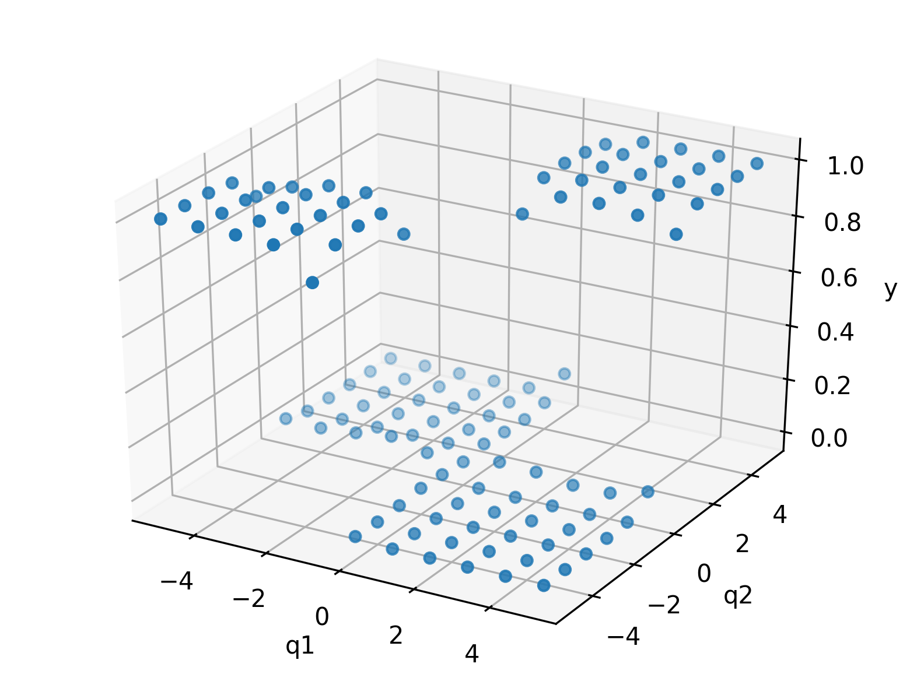
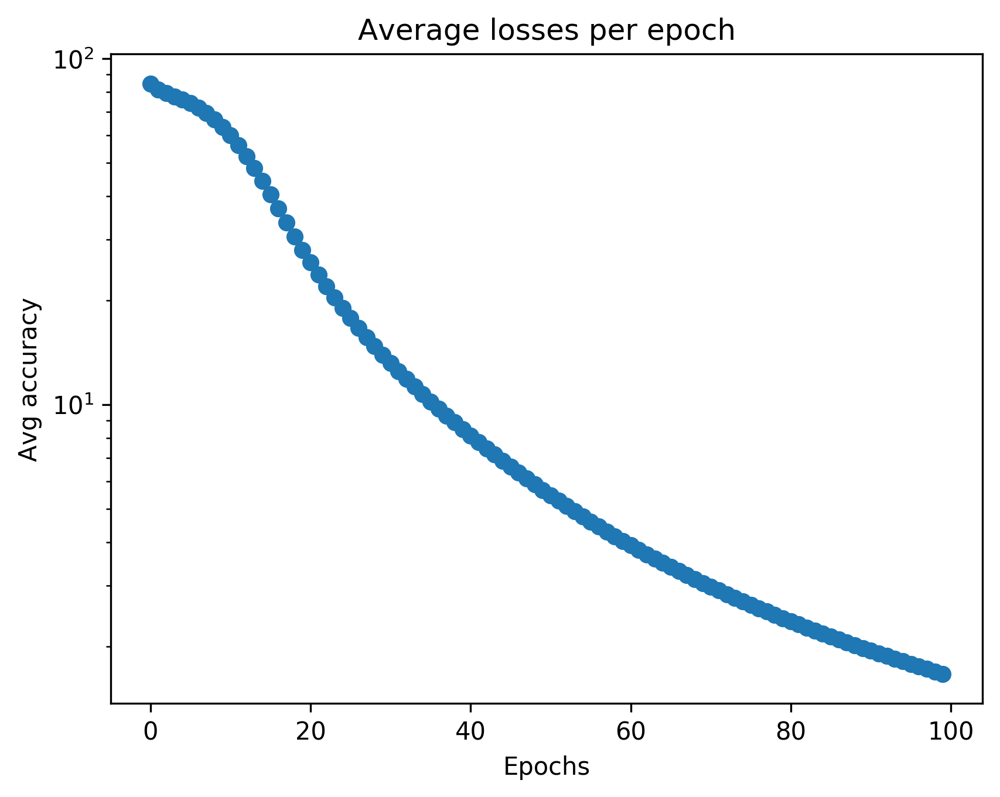
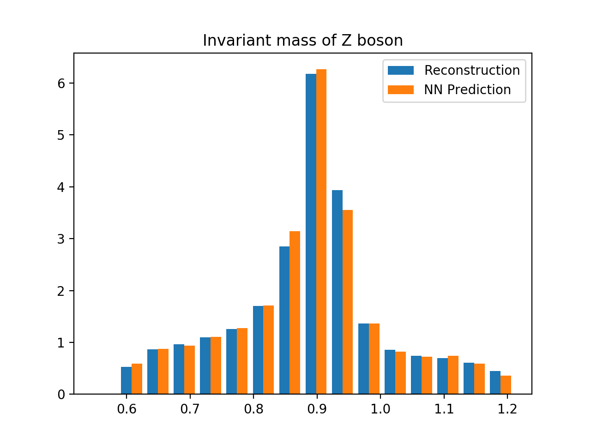
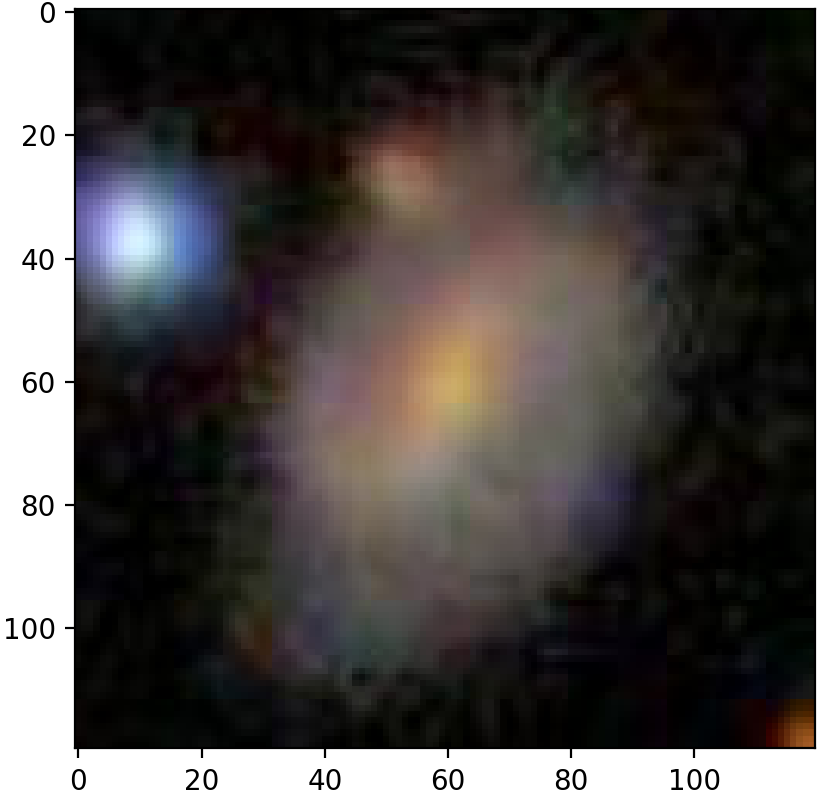
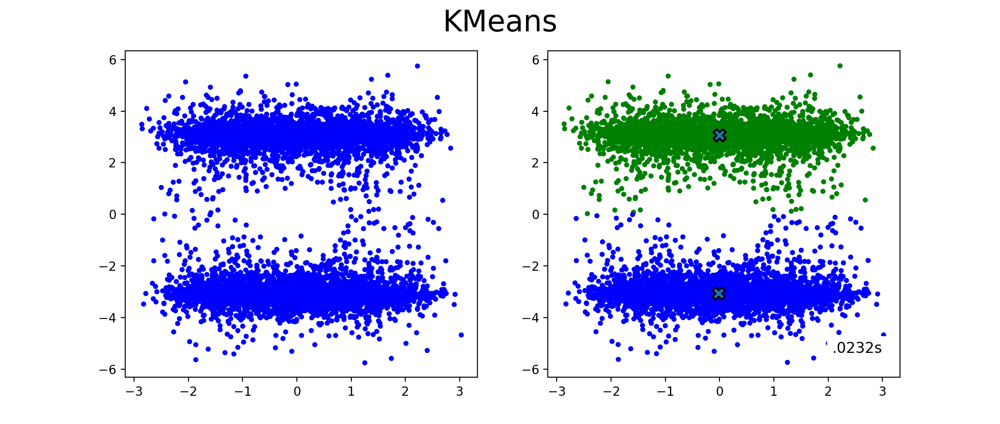
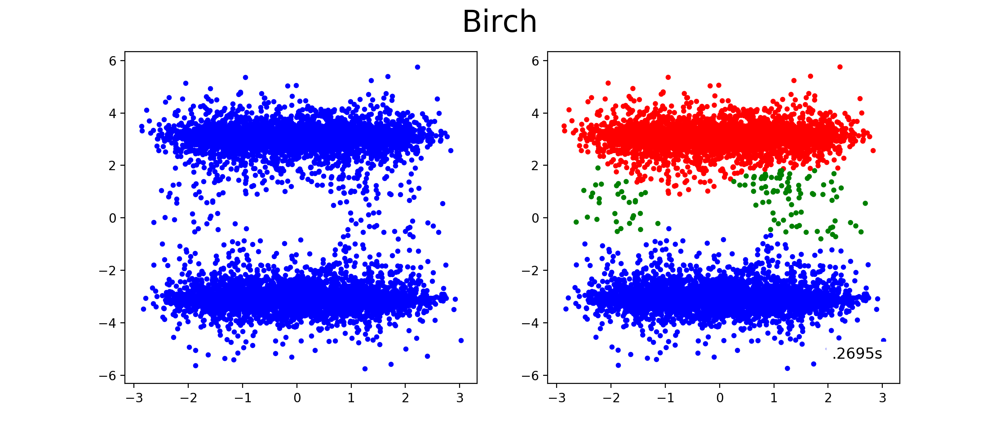
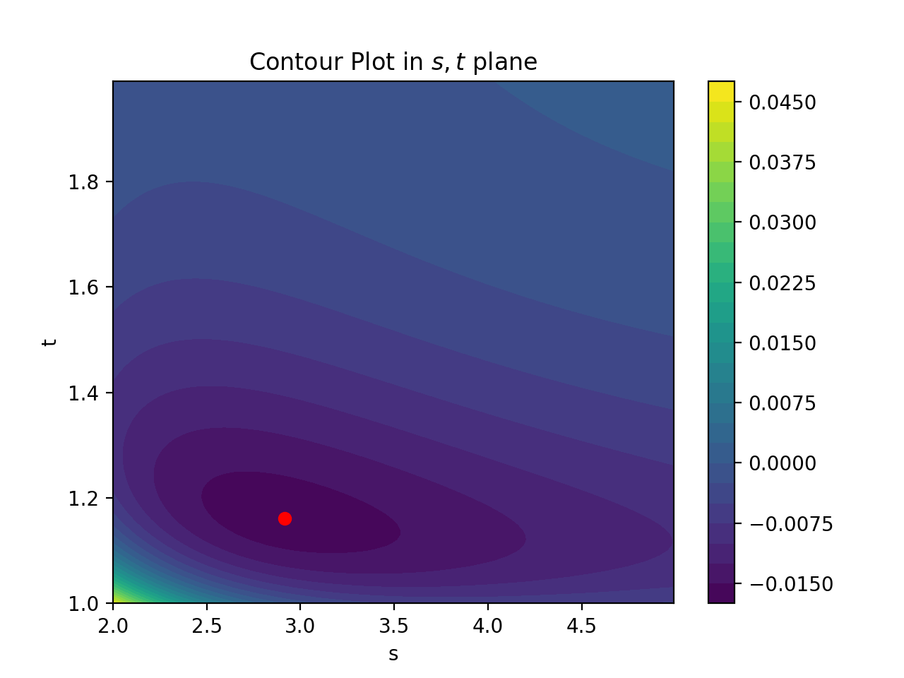
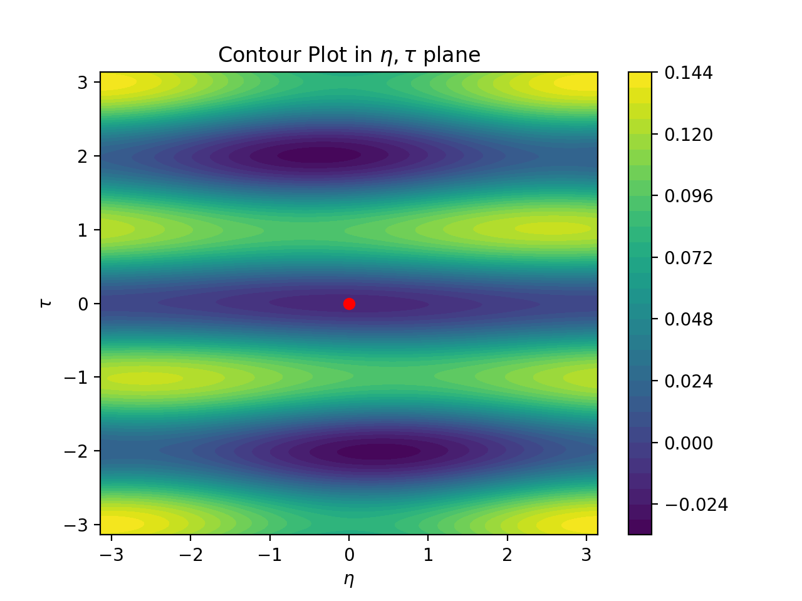

# Supplementary material for the Lecture "Introduction to ML for Physicists"

The syllabus of the course is available [here](./Syllabus.pdf). The repo also contains the exercises and solutions of the course.


## Week 5
In this [exercise](./Problem_set_1/problem_set_1.pdf), we set up a Python environment for Machine learning.  We create our first feed-forward neural network that learns to classify data into two or three classes using [Keras](https://keras.io) and [PyTorch](https://pytorch.org/docs/stable/). 

  

We also use CMS collider data (publicly available from [http://opendata.web.cern.ch](http://opendata.web.cern.ch)) to learn to predict the invariant mass of the Z boson in a Z -> e+ e- decay. The repository for the exercise with templates and solutions is available [here](./Problem_set_1/).




## Week 6
In this [exercise](./Problem_set_2/problem_set_2.pdf), we create our first convolutional neural network using PyTorch. We classify galaxies into spiral, elliptical or unknown. The data is provided by the [Galaxy Zoo](https://data.galaxyzoo.org) project. See [http://adsabs.harvard.edu/abs/2008MNRAS.389.1179L](http://adsabs.harvard.edu/abs/2008MNRAS.389.1179L) for more details. The pictures of the galaxies themselves are provided by the [Sloane Digital Sky Survey](https://www.sdss.org). The repository for the exercise with templates and solutions is available [here](./Problem_set_2/).

NN predicting this is a spiral galaxy:

 

(Image source: [https://www.sdss.org](https://www.sdss.org))

## Week 7
In this [exercise](./Problem_set_3/problem_set_3.pdf), we demonstrate how to code an environment that can be connected via the OpenAI gym to [ChainerRL](https://github.com/chainer/chainerrl). We illustrate how the the A3C agent finds good energy configurations for the 1D Ising model by flipping spins at any of the lattice sites.The repository for the exercise with templates and solutions is available [here](./Problem_set_3/).

```
I found an optimal configuration!
↑ ↑ ↑ ↑ ↑ ↑ ↑ ↑ ↑ ↑ ↑ ↑ ↑ ↑ ↑ 
I started from
↑ ↑ ↓ ↓ ↑ ↑ ↑ ↑ ↑ ↓ ↓ ↑ ↓ ↑ ↑ 
and took the actions
[10, 2, 3, 9, 12]
``` 

## Week 8
In this [exercise](./Problem_set_4/problem_set_4.pdf), we illustrate different unsupervised clustering algorithms (k-means, mean shift, DBSCAN, Birch) that were discussed in class using [scikit learn](https://scikit-learn.org/stable/). The repository for the exercise with templates and solutions is available [here](./Problem_set_4/).

 

We furthermore use genetic algorithms to minimize a superpotential of an N=1 SUSY theory, which arises e.g. from string theory.

 
